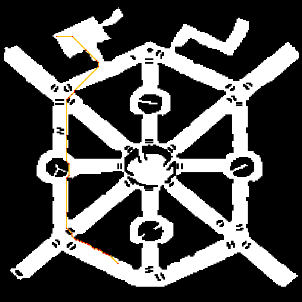

# Pathfinding algorithms (R\*)
Course project for HSE Computer Sceince Faculty

**Student:** Andrey Sokolov    
**Group:** БПМИ156    
**Mentor:** [Yakovlev K. S.](//github.com/konstantin-yakovlev)


### Contents

1. [Introduction](#introduction)    
2. [Tools used](#tools-used)    
3. [Work plan](#work-plan)
4. [How to build](#how-to-build)   
5. [How to run](#how-to-run)

## Introduction

Problem of finding path comes in different types of practical use, such as, for example, artifical intelligence systems. One important aspect of the problem is resource limitations - increase of map size causes dramatic growth of amount of memory and time required and in real life search agents possess very little of them.

History of this problem can be started from the article *'A note on two problems in connexion with graphs'* written by E. W. Dijkstra in 1959. After that big milestones were A\* and Jump-Point search algorithms improved performance a lot (these algorithms were researched and implemented during the [summer internship](//github.com/AndreSokol/pathfinding_algorithms)).

In this work I will research the R\*-search also known as randomized A\*-search and try to improve its performance.

## Tools used

This work is based on code written for ISA RAS researches in order to achieve compability with their huge set of pre-generated tests. That is the main reason to choose the following tools:

**Programming language:** MinGW GNU C++, XML (for input files)    
**IDE:** QtCreator 3.6.1    
**Compiler:** qmake + MinGW         
**External library:** TinyXML 2 (for parsing input files)    

## Work plan

**Dec 2016 - Jan 2017**: study existing work on R\*-search    
**Jan 2017 - Feb 2017**: implement R\*-search and conduct tests    
**Feb 2017 - Mar 2017**: theoretical work on possible improvments of R\*    
**Mar 2017 - Apr 2017**: implement improvments, conduct tests

## How to build

To build the project you can use file 'build.bat'. To build it manually use the following commands:

```
qmake {project_root}/sources/pathfinding_r_star.pro -r -spec win32-g++ "CONFIG+=release" "CONFIG+=qml_release"
mingw32-make release
```

Builded file can be found as `{project_root}/release/release/pathfinding_r_star.exe` if built with bat-file.

## How to run

Sample tasks can be found in `{project_root}/resources`. Here's the example of running one of the tasks:

```
release/release/pathfinding_r_star resources/3750804-BG.xml
```

If not set otherwise output for the task will be written in the file named `{input-file}_log.xml`, e.g. `resources/3750804-BG_log.xml` in this case.

If path found you can visualize it by running additional script and passing output XML into it:

```
python test_utility.py resources/3750804-BG_log.xml 3
```

_"3" means each cell will by 3 pixels by 3 pixels in resulting image_

Result of visualizing saves in `{project_root}/test_image.bmp`. This is what we get in our case:


